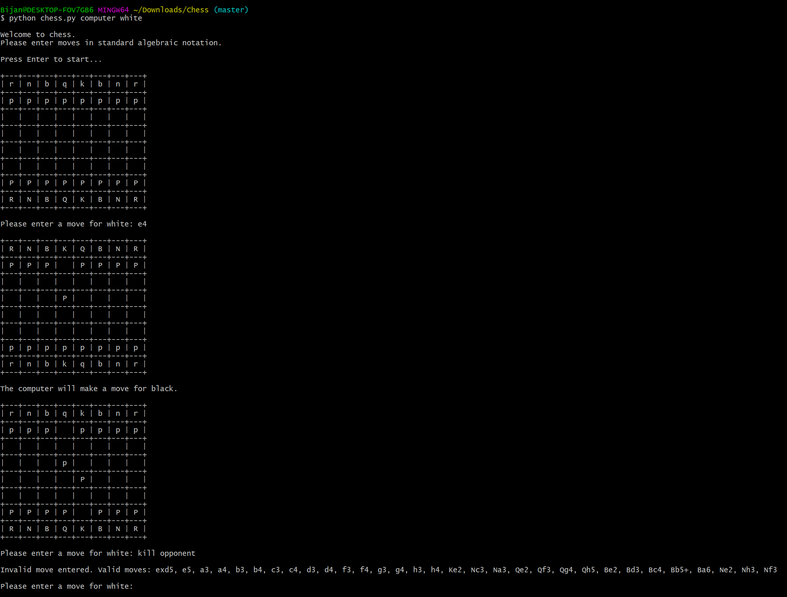
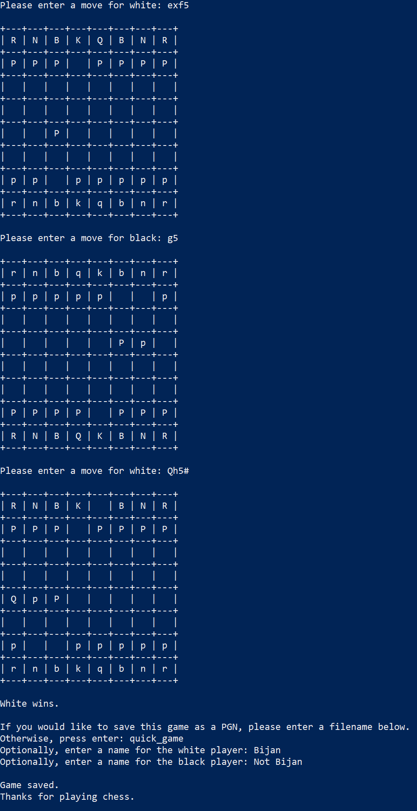

# Chess
This is a simple command line chess game. Run it with
```
$ python3 chess.py MODE [COLOR]
```
where `MODE` is either `human` or `computer`. The `human` mode is a normal two-player chess game, whereas the `computer` mode pits you 
against an AI player. When choosing the `computer` mode, there is an option to specify which color (white or black) you would like to use.
During play, moves should be entered in standard [algebraic notation](https://en.wikipedia.org/wiki/Algebraic_notation_(chess)). When a 
game ends, it can be saved in [PGN](https://en.wikipedia.org/wiki/Portable_Game_Notation) format.

The AI used by the `computer` mode can be changed by modifying the `ai_module` variable at the beginning of `chess.py`. This variable 
should be set to the name of a Python file (without the ".py") that implements the `get_move(game)` function, which should take in the 
current `Game` object and return a string representing a move in algebraic notation. For examples, see `minimax_ai.py`, a simple AI that 
uses depth-limited minimax with alpha-beta pruning, and `sf-wrapper.py`, a wrapper for the popular chess engine [Stockfish](https://stockfishchess.org/).
Note that to use the latter, you will need to download Stockfish and place `stockfish_10_x32` in the same directory as `sf_wrapper.py`.

# Screenshots

|  |  |
| ---------------------------------------- | ------------------------------------ |